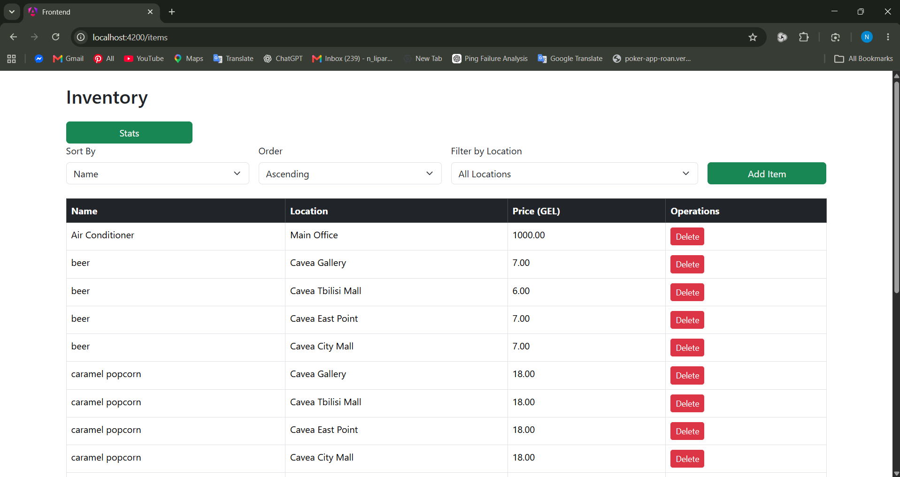
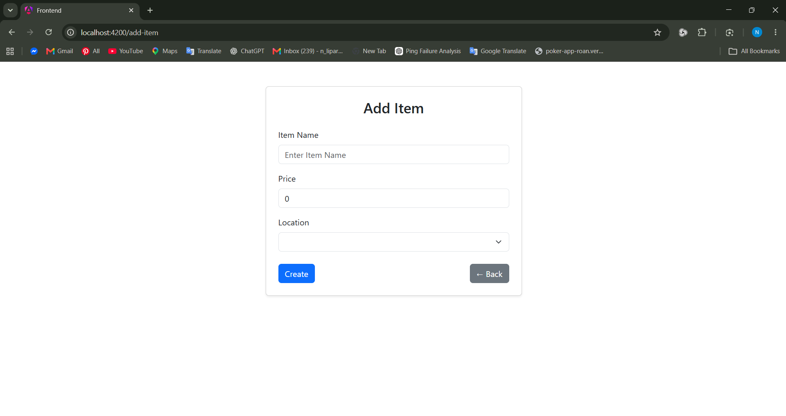
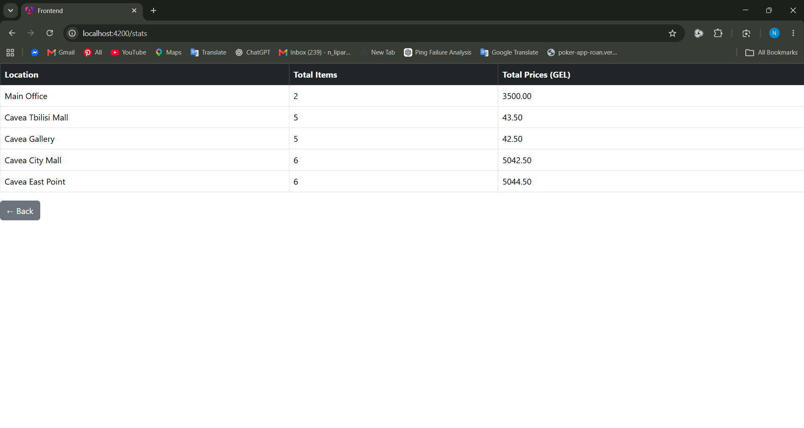
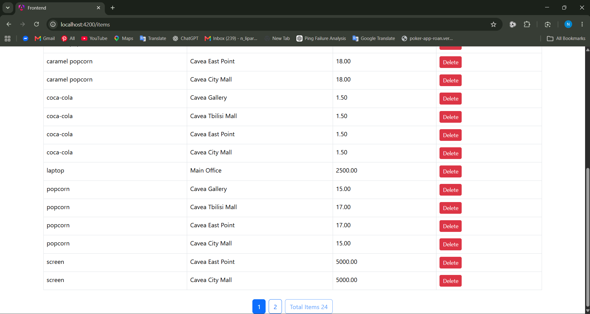
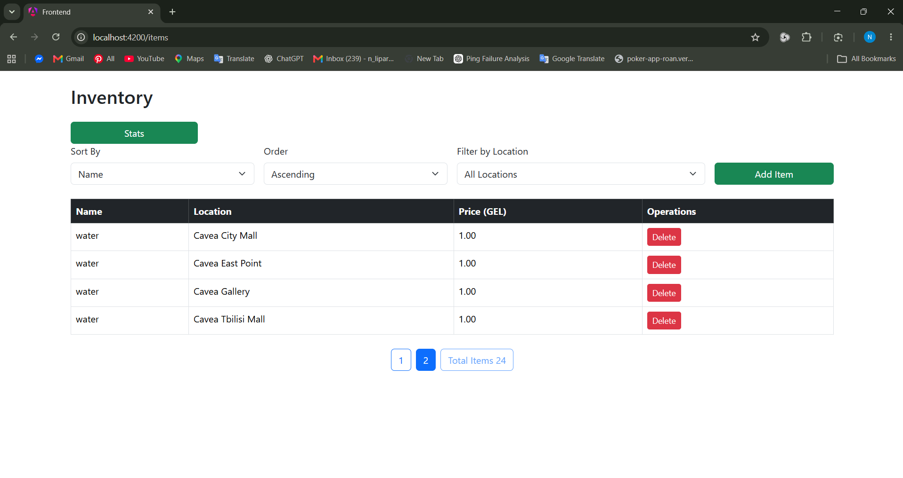

# Inventory Management System

A full-stack inventory management application built with Angular, Node.js, Express, PostgreSQL, and Sequelize.

The application allows users to manage inventory items, filter and sort data, paginate through records, and view location-based inventory statistics.

note:see screenshots below

## Features

### Inventory Management
- View all inventory items
- Create new items
- Delete items
- Filter items by location
- Sort items in ascending or descending order by:
  - Name
  - Price
  - Location
- Pagination with configurable page size

### Location Management
- Display available inventory locations
- Associate items with locations
- View inventory statistics grouped by location

### Statistics Dashboard
- Total number of items per location
- Total inventory value per location
- SQL aggregation queries using:
  - COUNT
  - SUM
  - GROUP BY

## Technologies

### Frontend
- Angular
- TypeScript
- Bootstrap
- RxJS
- Angular Router

### Backend
- Node.js
- Express.js
- TypeScript
- Sequelize ORM
- PostgreSQL

## Architecture


The application follows a layered architecture, shown with an example of one endpoint request flow.

1. When navigating to the site, Angular's `item-iist` component is loaded (contains `item-list.ts` and `item-list.html`). When the component is loaded, Angular's `OnInit` function runs once and calls `loadItems()`.

2. `loadItems()` is used to send a GET request for retrieving items, but it does not send it directly. It first calls the frontend service function `getItems()`.

3. `getItems()` is declared and implemented in a separate file inside the `ItemService` class. It uses Angular `HttpClient` to send an HTTP GET request with page parameters (and optionally filtering and sorting parameters) to the specified URL and waits for the response.

4. On the backend, routes, endpoint URLs, and their corresponding controller functions are declared in the separate `routes.ts` file. When the server receives the request, Express matches it to the declared route, in this case `GET /api/inventories`.

5. If matched, the corresponding controller function is called, for example `getAllHandler()` in `itemsController.ts`. `getAllHandler()` receives the request, extracts the page parameter for pagination, and optionally extracts sorting and filtering parameters.

6. The controller then calls the backend service async function `getAllItems()` from `itemService.ts`.

7. `getAllItems()` queries the database using Sequelize, retrieves 20 items per page, skips `20 * (page - 1)` items for pagination, and retrieves the total item count.

8. The service returns the result to the controller. If no error occurs, the controller sends the result back to the frontend as JSON.

9. The frontend service function `getItems()` receives the response and returns the data to the `ItemList` component. `loadItems()` receives the data, assigns it to the component variables, and Angular displays the received data in the HTML template.


## How to Run

### Prerequisites

Make sure you have installed:

- Node.js
- PostgreSQL
- Angular CLI

---

### Backend

1. Navigate to the backend directory.

```bash
cd backend
```

2. Install dependencies.

```bash
npm install
```

3. Configure your PostgreSQL database and update the database configuration (or `.env` file if you use one), change database password.
```bash
DB_HOST=localhost
DB_PORT=5432
DB_USER=postgres
DB_PASSWORD="your_database_password"
PORT=3000
DB_NAME=inventory_db
```

4. Start the backend server.

```bash
npm start
```

The backend will run on:

```
http://localhost:3000
```

---

### Frontend

1. Navigate to the frontend directory.

```bash
cd frontend
```

2. Install dependencies.

```bash
npm install
```

3. Start the Angular development server.

```bash
ng serve
```

The frontend will run on:

```
http://localhost:4200
```

---

### Using the Application

1. Open `http://localhost:4200` in your browser.
2. Browse the inventory list.
3. Add new inventory items.
4. Filter and sort items.
5. View inventory statistics.


## Screenshots

### Inventory List



### Add Item



### Statistics



### Pagination 





